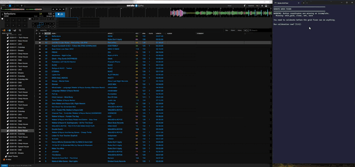

# Serato Grid Fixer

A tiny Windows hotkey utility for [Serato DJ Pro](https://serato.com/dj/pro) that automates the tedious button-clicking sequence when you're fixing a misaligned beatgrid.

## The problem

SoundCloud and other streaming tracks often load with misaligned beatgrids in Serato — sometimes off by a beat, sometimes off by a full bar, sometimes just plain wrong. The manual workflow is mind-numbing:

1. Find the first kick (by ear or eye)
2. Seek/play to that position
3. Edit Grid → Clear → Set → Save
4. Set Hot Cue 1
5. Load the next track
6. Repeat for 50+ tracks 😫

You handle the hard part — finding the kick. This tool handles the click-soup.

> **Problem solved:** ripped through 250+ tracks before I finished a beer.

## What it does

Press <kbd>~</kbd> (the backtick/tilde key) at the position where you want the grid set, and the tool runs:

**Edit Grid → Clear → Set → Save → Hot Cue 1 → load next track**

That's the entire app. One key, one shot.



## Quick start

```powershell
# 1. Install dependencies
pip install -r requirements.txt

# 2. Calibrate the four grid-edit button positions in your Serato layout
python calibrate_buttons.py

# 3. Run it
python grid_fixer.py
```

Or just double-click `launch_grid_fixer.cmd` (and `launch_calibrator.cmd` for recalibration).

## Usage

1. Open Serato DJ Pro and load a track on the **left deck**.
2. Run `grid_fixer.py`.
3. Seek or play to the exact point where you want the grid anchored (typically the first kick).
4. Press <kbd>~</kbd>. The tool clicks Edit Grid → Clear → Set → Save, sets Hot Cue 1, then loads the next track in your library.
5. Repeat for the next track.
6. Press <kbd>F12</kbd> to exit.

**Mouse failsafe:** slam your mouse into the top-left corner of the screen to abort whatever pyautogui is doing.

### Workflow tip: sort by track number, descending

Sort your library/crate by track number in descending order before you start. New tracks land at the top, so as the tool auto-advances with each <kbd>~</kbd> press you're always working on tracks that haven't been gridded yet. Otherwise you'll start clobbering tracks you've already set up.

## Calibration

`config.json` stores the on-screen pixel coordinates of four buttons in the Serato Beatgrid Edit panel:

```json
"grid_edit": {
  "edit_grid": [x, y],
  "clear":     [x, y],
  "set":       [x, y],
  "save":      [x, y]
}
```

Run `python calibrate_buttons.py` (or double-click `launch_calibrator.cmd`) and click each button when prompted. Coordinates are saved to `config.json` immediately after each click, so you can ctrl-C out partway through without losing what you've already done.

You'll need to recalibrate any time the Serato layout changes — for example, if you resize/move the window, switch monitors or DPI scaling, or **plug in (or unplug) a DJ controller**, since Serato shifts the layout to add deck/mixer panels when a controller is connected. Calibrate against the layout you actually use day-to-day (most likely: controller plugged in).

## How it works (briefly)

- `keyboard` listens for the global <kbd>~</kbd> hotkey.
- `pyautogui` clicks the four button coordinates from `config.json` in sequence.
- A few `keyboard.send` calls fire <kbd>Ctrl+1</kbd> (Hot Cue 1) and <kbd>Alt+W</kbd> (Serato's "load next track" shortcut), then <kbd>↓</kbd> to advance the library cursor so the *next* press works on the right track.

The hot cue is set at the exact same position as the grid anchor — useful as a "go back to where I started this track" reference if you don't beat-jump back to bar 1.

## Requirements

- Windows (the `keyboard` library needs admin-style hooks; macOS isn't supported here)
- Python 3.10+
- Serato DJ Pro
- A standard left-deck layout (the Hot Cue 1 hotkey assumes left deck)

## Limitations

- **Left deck only.** Hot Cue 1 binds to <kbd>Ctrl+1</kbd> on the left deck; the right deck would need <kbd>Ctrl+6</kbd>.
- **Layout-dependent.** Calibrated coordinates break if you resize the Serato window or move the Beatgrid Edit panel. Recalibrate when that happens.
- **No undo.** If the wrong grid gets set, fix it in Serato manually.

## License

MIT — see [LICENSE](LICENSE).
